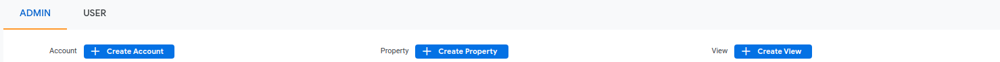
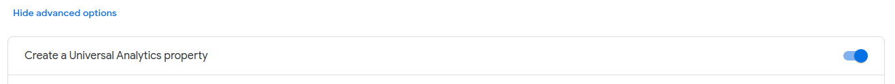
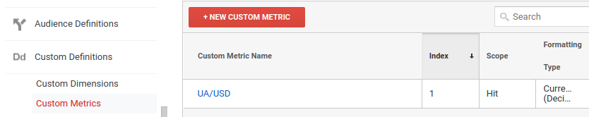
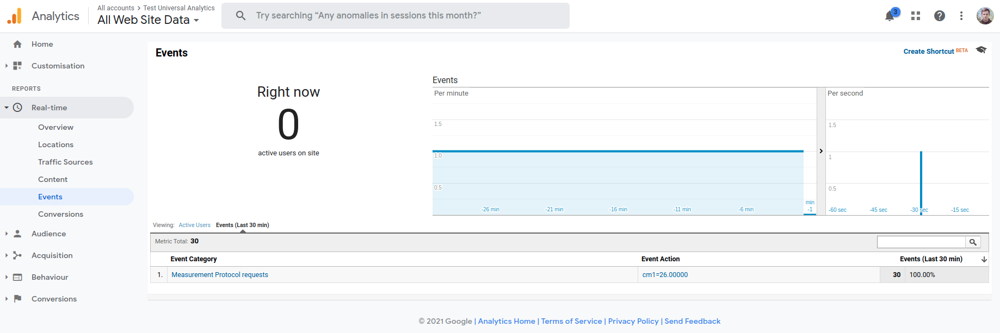
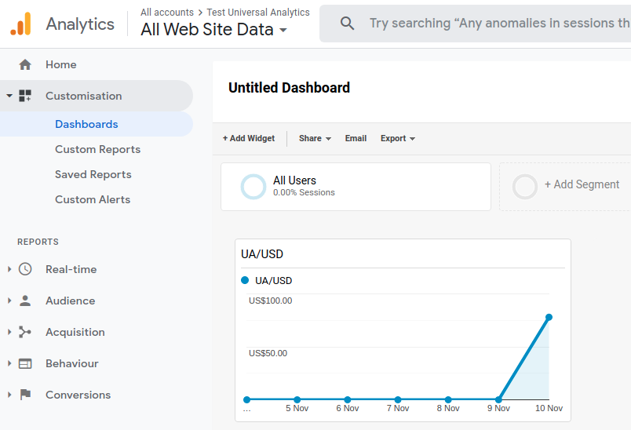
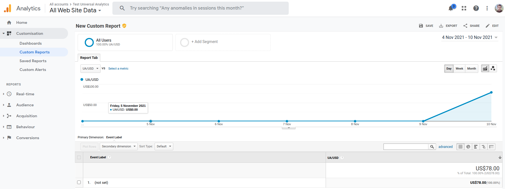

# Google Analytics: custom metrics
Script for sending each minute custom created metric to Google Analytics (GA) through Google Analytics Management Protocol (GAMP)

**important notice:** This repo is just a demonstration of abilities of GAMP and simplicity of sending custom metrics or events to Google Analytics. This example does not carry any logical meaning and value.   

### Requirements:
 - [docker](https://docs.docker.com/get-docker/) >20.10.7
 - [docker-compose](https://docs.docker.com/compose/install/) >2.1.0

### Setup
Create in GA new Property (with _Create a Universal Analytics property_ option) and get it's ID for config (variable `PROPERTY_ID`)



Below, in Property column, select **PRODUCT LINKING → Custom Definitions → Custom Metrics** and create a Custom Metric

Metric index would be an `EVENT_INDEX` variable for config

Then need to clone the git repository. In cloned directory create config file `env.currency_rate` with next content (replace variables with actual data from GA):
```
PROPERTY_ID=XX-000000000-0
EVENT_INDEX=X
```

### Run on linux
To run a script simply execute `run.sh` file:
```shell
sudo sh run.sh
```
or do it by staring docker-compose manually:
```shell
sudo docker-compose down
sudo docker-compose up -d
```

To get logs, execute next command:
```shell
sudo docker-compose logs currency_rate
```

If everything was installed correctly, events would appear (each minute) in **Real-time → Events**:


Also, that events (custom metric) can be added to Dashboards Widgets**:


and to Custom Report**:


** data can appear there up 48 hours after sending  
